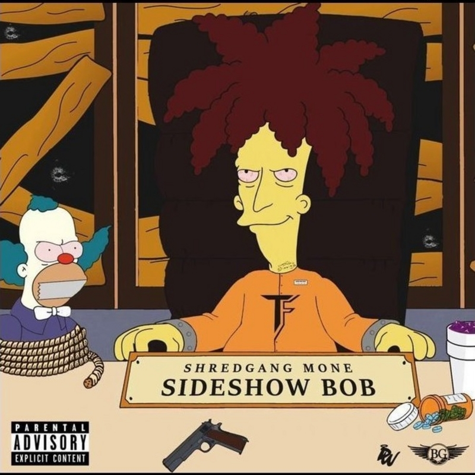

# Hack The Box Write Ups
This repo contains write-ups for various challenges and machines for the Hack The Box platform. This platofrm has a strict anti-cheating policy so all the write-ups are password protected until they are retired from the current set. 

## Contributors

   | Country | Nickname | Avatar | Team | Machines | Challenges | Rank |
|---------|----------|--------|------|----------|------------|------------|
||[Pimmytrousers](https://www.hackthebox.eu/profile/7603)||BitsPlz|[Nibbles](./machines/Chatterbox/chatterbox.pdf), [Chatterbox](./machines/Nibbles/nibbles.pdf), [Poison](/machines/Poison/poison.pdf), [Celestial](./machines/Celestial/celestial.pdf), [Valentine](./machines/Valentine/valentine.pdf), [Sunday](./machines/Sunday/sunday.pdf), [Jerry](./machines/Jerry/jerry.pdf)|            |Hacker|
||[Khedron](https://www.hackthebox.eu/profile/45896)||BitsPlz|[Nibbles](./machines/Nibbles/nibbles_ben.7z)|         |Script Kiddie|
||[Bagreen](https://www.hackthebox.eu/profile/46474)||BitsPlz|[Blue](https://github.com/PimmyTrousers/HackTheBoxWriteUps/blob/master/machines/Blue_ben.7z), [Lame](https://github.com/PimmyTrousers/HackTheBoxWriteUps/blob/master/machines/Lame_ben.7z), [Nibbles](https://github.com/PimmyTrousers/HackTheBoxWriteUps/blob/master/machines/Nibbles/nibbles_ben.7z), [Sunday](https://github.com/PimmyTrousers/HackTheBoxWriteUps/blob/master/machines/Sunday/sunday_ben.7z), [Valentine](https://github.com/PimmyTrousers/HackTheBoxWriteUps/blob/master/machines/Valentine/valentine_ben.7z)|[classic_yet_complicated](https://github.com/PimmyTrousers/HackTheBoxWriteUps/blob/master/challenges/classic_yet_complicated_ben.7z), [deceitful_batman](https://github.com/PimmyTrousers/HackTheBoxWriteUps/blob/master/challenges/deceitful_batman_ben.7z), [SickTeacher](https://github.com/PimmyTrousers/HackTheBoxWriteUps/blob/master/challenges/SickTeacher_ben.7z), [you_can_do_it](https://github.com/PimmyTrousers/HackTheBoxWriteUps/blob/master/challenges/you_can_do_it_ben.7z)        |Script Kiddie|

## How To Contribute 
The way this repo works, is that all write ups must be password protected PDFs and those are the only files that are allowed in the challenge directories. Personally I write them in markdown and convert them to PDFs with VSCode's `markdown PDF` extension. I place screenshots in the picture folder with names starting with `do_not_include` so they are included when being added to the repo. Ive tried to make the .gitignore strong enough so that no misc files get uploaded. 
